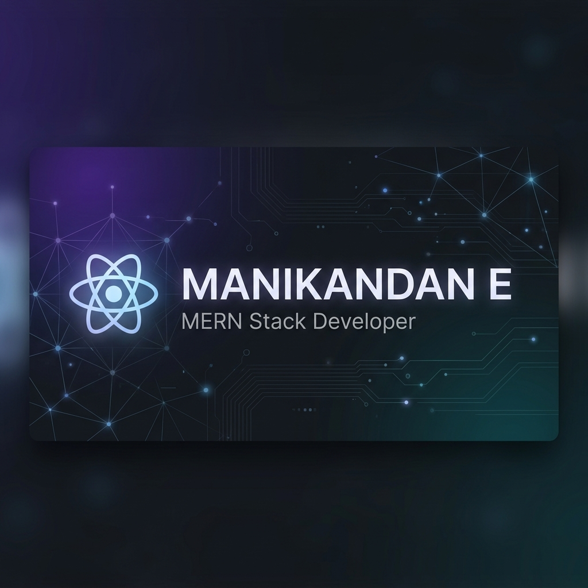

<!-- Beautiful banner generated by Antigravity AI -->

  

  
  # 🚀 Hi there, I'm Manikandan E! 👋
  
  ### **MERN Stack Developer | Full Stack Engineer | React Specialist**

  

    
    
    
  

---

### 💫 About Me

I am a creative and focused **MERN Stack Developer** dedicated to building modern, responsive, and user-friendly web applications. As a developer, I love transforming complex client ideas and requirements into clean, functional, and maintainable code. 

I bridge the gap between frontend design and backend architecture, ensuring seamless data integration and exceptional user experiences.

- ⚡ **Fun fact:** I'm always looking for ways to optimize database queries and make page transitions smoother.
- 🎓 **Focus:** Currently engineering scalable RESTful architectures and refining my component design systems.

---

### 🛠️ My Technical Toolbox

| 🎨 Frontend Development | ⚙️ Backend & Database | 🛠️ Tools & Systems |
| :--- | :--- | :--- |
|  |  |  |
|  |  |  |
|  |  |  |
|  |  |  |
|  | | |
|  | | |

---

### 🔥 Core Expertise

* 🚀 **Full-Stack Architecture** — Seamlessly connecting interactive React frontends with robust Node.js/Express backends.
* 📦 **Component Design** — Architecting reusable, clean, and highly optimized React components.
* ⚡ **API Engineering** — Designing secure, scalable, and efficient RESTful APIs integrated with MongoDB.
* 📱 **Responsive UI/UX** — Writing pixel-perfect interfaces tailored for a flawless experience across all device sizes.

---

### 📊 GitHub Analytics

  <table border="0">
    <tr>
      <td width="50%" align="center">
        
      </td>
      <td width="50%" align="center">
        
      </td>
    </tr>
    <tr>
      <td colspan="2" align="center">
         
        
      </td>
    </tr>
  </table>

---

### 🎯 Current Focus & Opportunities

* 💼 **Actively Seeking Roles:** Open to **MERN Stack Developer**, **Full Stack Developer**, or **React Developer** positions.
* 📈 **Continuous Learning:** Constantly building performance-focused applications to sharpen my engineering skills.

  Let's connect and build something extraordinary!

